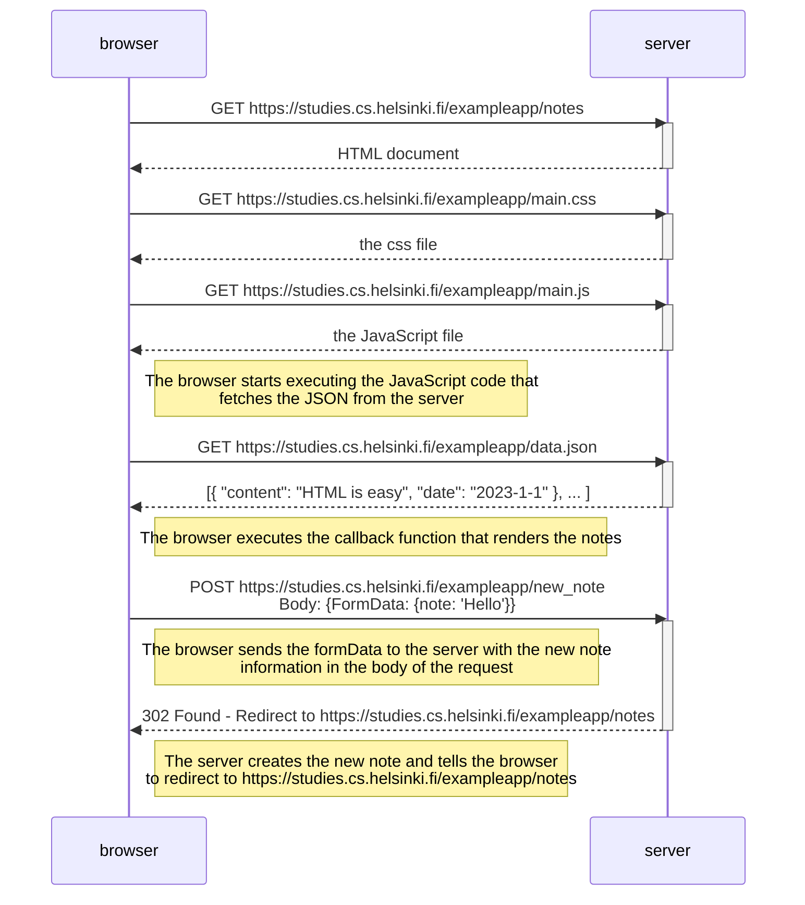

```mermaid
sequenceDiagram
    participant browser
    participant server

    browser->>server: GET https://studies.cs.helsinki.fi/exampleapp/notes
    activate server
    server-->>browser: HTML document
    deactivate server

    browser->>server: GET https://studies.cs.helsinki.fi/exampleapp/main.css
    activate server
    server-->>browser: the css file
    deactivate server

    browser->>server: GET https://studies.cs.helsinki.fi/exampleapp/main.js
    activate server
    server-->>browser: the JavaScript file
    deactivate server

    Note right of browser: The browser starts executing the JavaScript code that<br/>fetches the JSON from the server

    browser->>server: GET https://studies.cs.helsinki.fi/exampleapp/data.json
    activate server
    server-->>browser: [{ "content": "HTML is easy", "date": "2023-1-1" }, ... ]
    deactivate server

    Note right of browser: The browser executes the callback function that renders the notes

    browser->>server: POST https://studies.cs.helsinki.fi/exampleapp/new_note<br/>Body: {FormData: {note: 'Hello'}}
    
    activate server

    Note right of browser: The browser sends the formData to the server with the new note<br/>information in the body of the request
    
    server-->>browser: 302 Found - Redirect to https://studies.cs.helsinki.fi/exampleapp/notes
    deactivate server

    Note right of browser: The server creates the new note and tells the browser<br/>to redirect to https://studies.cs.helsinki.fi/exampleapp/notes
```