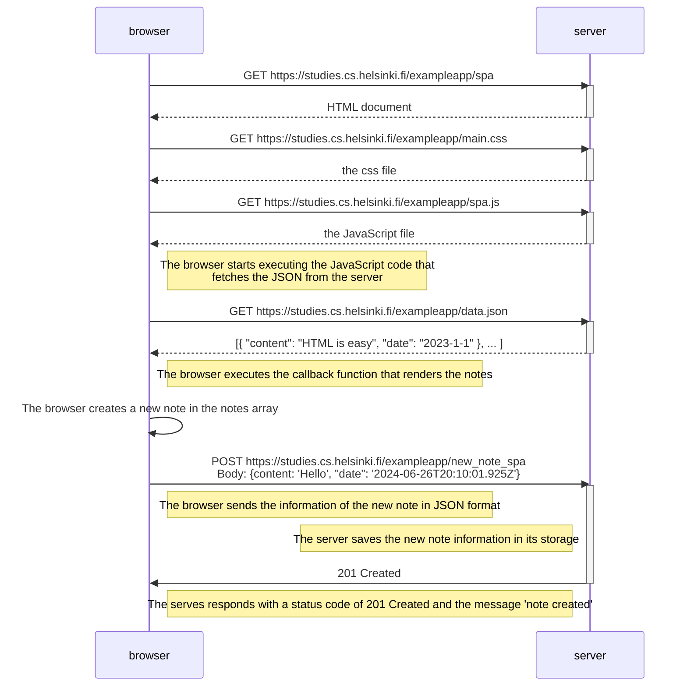

```mermaid
sequenceDiagram
    participant browser
    participant server

    browser->>server: GET https://studies.cs.helsinki.fi/exampleapp/spa
    activate server
    server-->>browser: HTML document
    deactivate server

    browser->>server: GET https://studies.cs.helsinki.fi/exampleapp/main.css
    activate server
    server-->>browser: the css file
    deactivate server

    browser->>server: GET https://studies.cs.helsinki.fi/exampleapp/spa.js
    activate server
    server-->>browser: the JavaScript file
    deactivate server

    Note right of browser: The browser starts executing the JavaScript code that<br/>fetches the JSON from the server

    browser->>server: GET https://studies.cs.helsinki.fi/exampleapp/data.json
    activate server
    server-->>browser: [{ "content": "HTML is easy", "date": "2023-1-1" }, ... ]
    deactivate server

    Note right of browser: The browser executes the callback function that renders the notes

    browser->>browser: The browser creates a new note in the notes array

    browser->>server: POST https://studies.cs.helsinki.fi/exampleapp/new_note_spa<br/>Body: {content: 'Hello', "date": '2024-06-26T20:10:01.925Z'}

    activate server

    Note right of browser: The browser sends the information of the new note in JSON format

    Note left of server: The server saves the new note information in its storage
    
    server->>browser: 201 Created
    deactivate server

    Note right of browser: The serves responds with a status code of 201 Created and the message 'note created'
```